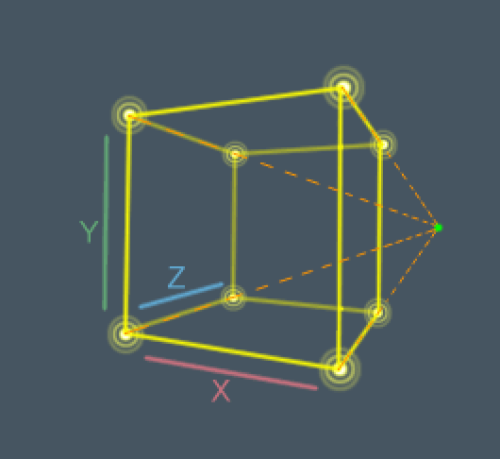

# Qube | 3-D design leveraging perspective css property 

The `perspective` property helps to control the volume of the cube design and together with use of `transform` property, the Qube will show all the characteristics of a rotational object that operates in a 3-D space.

- `X-axis` > horizontal plane
- `Y-axis` > vertical plane
- `Z-axis` > Supports the rotation to the DOM elements

In addition, the `perspective-origin` css property will be used to determine the position from which the user is looking at the Qube. 

## Demo
Link to the [live](https://spagettileg.github.io/Qube/) website hosted in GitHub Pages 

Link to [GitHub](https://github.com/Spagettileg/Qube) Repo

***

